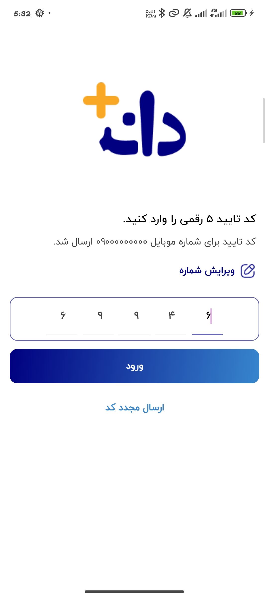

# 🎓 Daneshjooyar Fake

## 📖 Overview

**Daneshjooyar Fake** is a modern Android educational platform application designed to provide a smooth, fast, and interactive learning experience. Inspired by educational platforms, it offers features for browsing courses, managing categories, and tracking user progress.

The project is built entirely with **Jetpack Compose** and follows a clean **MVVM architecture**, ensuring the codebase is scalable, maintainable, and modular. It leverages modern Android development tools like **Hilt** for dependency injection, **Room** for local data persistence, and **Retrofit** for seamless network communication.

## ✨ Key Features

*   **Modern UI:** Built entirely with **Jetpack Compose** and **Material 3**.
*   **Architecture:** Clean **MVVM** implementation for better separation of concerns.
*   **Course Browsing:** Dynamic catalog of courses and categories.
*   **Video Playback:** Integrated **ExoPlayer (Media3)** for high-quality video streaming.
*   **Authentication:** Phone-based login and verification system.
*   **Data Management:** Local storage with **Room** and settings management with **DataStore**.
*   **Network:** Robust API integration using **Retrofit**.
*   **Animations:** Smooth UI transitions and interactive elements using **Lottie**.
*   **Dark Mode Support:** Fully compatible with Material 3 dynamic color and dark themes.

## 🛠 Tech Stack

| Category             | Technology                                      |
| -------------------- | ----------------------------------------------- |
| **Architecture**     | MVVM (Model-View-ViewModel)                     |
| **UI Toolkit**       | Jetpack Compose                                 |
| **Design System**    | Material 3                                      |
| **DI**               | Dagger-Hilt                                     |
| **Networking**       | Retrofit & Gson                                 |
| **Local Storage**    | Room Database & DataStore Preferences           |
| **Image Loading**    | Glide for Compose                               |
| **Video Player**     | Media3 ExoPlayer & Compose Video                |
| **Navigation**       | Compose Navigation                              |
| **Animations**       | Lottie Compose                                  |
| **Other Libraries**  | Accompanist System UI Controller, Kotlin Coroutines |

## 📱 Screenshots

Explore the main sections of the application, including the home dashboard, certificates, login flow, and more.

<table style="width:100%">
  <tr>
    <th>Home Screen</th>
    <th>Certificates Screen</th>
    <th>About Screen</th>
  </tr>
  <tr>
    <td></td>
    <td></td>
    <td></td>
  </tr>
  <tr>
    <th>Course Detail</th>
    <th>Verification</th>
    <th>Video player</th>
  </tr>
  <tr>
    <td></td>
    <td></td>
    <td></td>
  </tr>
</table>
